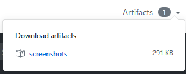

When working with Actions, you may wish to export artifacts from a workflow for later usage either after the workflow is done or in other jobs. The [actions/download-artifact](https://github.com/actions/download-artifact) and [actions/upload-artifact](https://github.com/actions/upload-artifact) actions built by the Actions team provide functionality to upload and download zips of folders.

When you upload an artifact, it will be present in the top right corner of the Dashboard for a specific workflow. It will be available for 30 days in workflows on PRs and 90 days for regular workflows.



To do an upload, copy the following into a job:

```yaml title=upload-file.yml
steps:
  - uses: actions/checkout@v1

  - run: mkdir -p path/to/artifact

  - run: echo hello > path/to/artifact/world.txt

  - uses: actions/upload-artifact@master
    with:
      name: my-artifact
      # you currently have to upload an entire folder so if you don't wish to upload a
      # lot of content, move the build artifacts you want to a unique folder
      path: path/to/artifact
```

and then to download said artifact within the same workflow but another job,

```yaml title=download-file.yml
steps:
  - uses: actions/checkout@master

  - uses: actions/download-artifact@master
    with:
      name: my-artifact

  - run: cat my-artifact
```

Artifacts can only go cross-jobs. For cross-action transferring, look instead at [Transferring data between Actions](/docs/transferring-data/).
