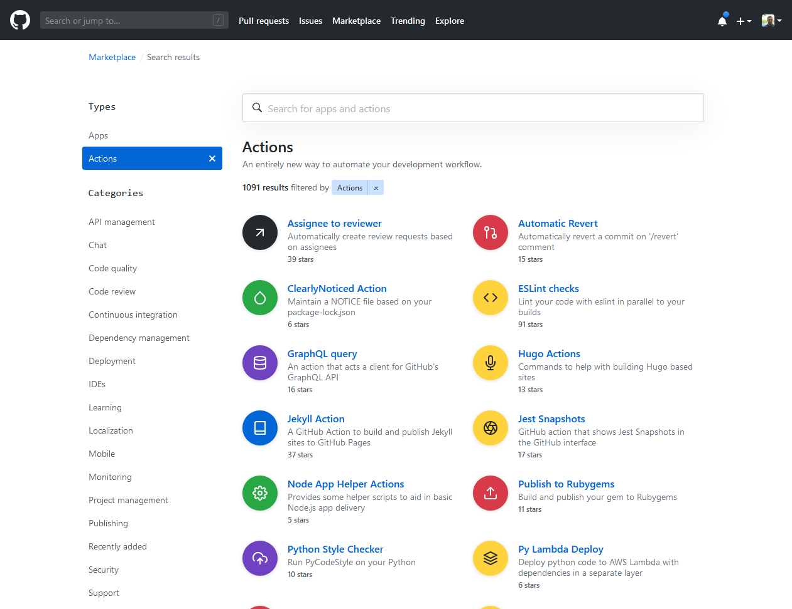
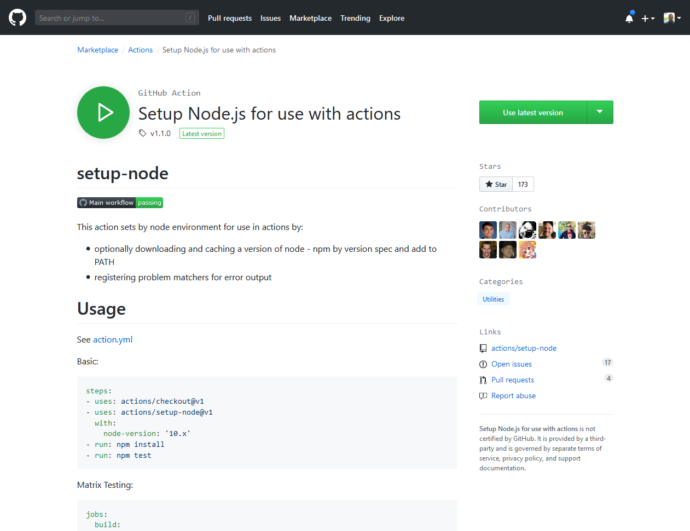
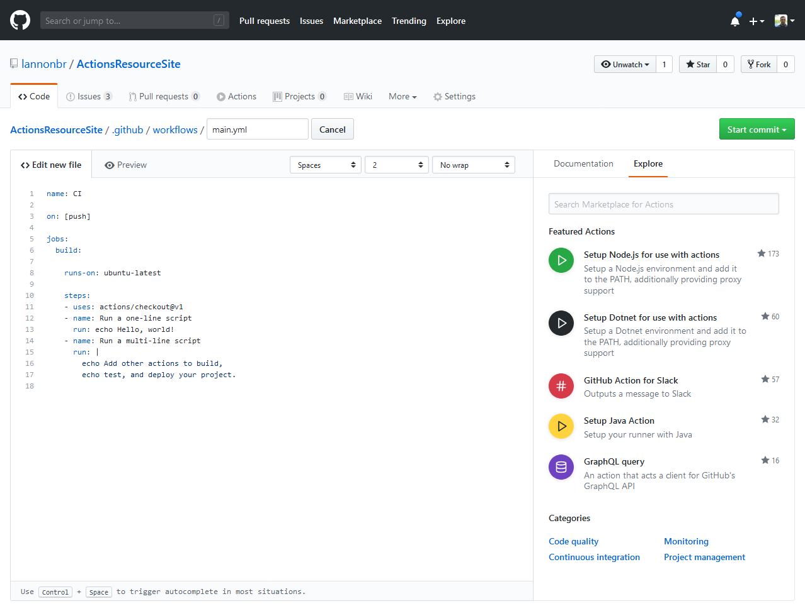
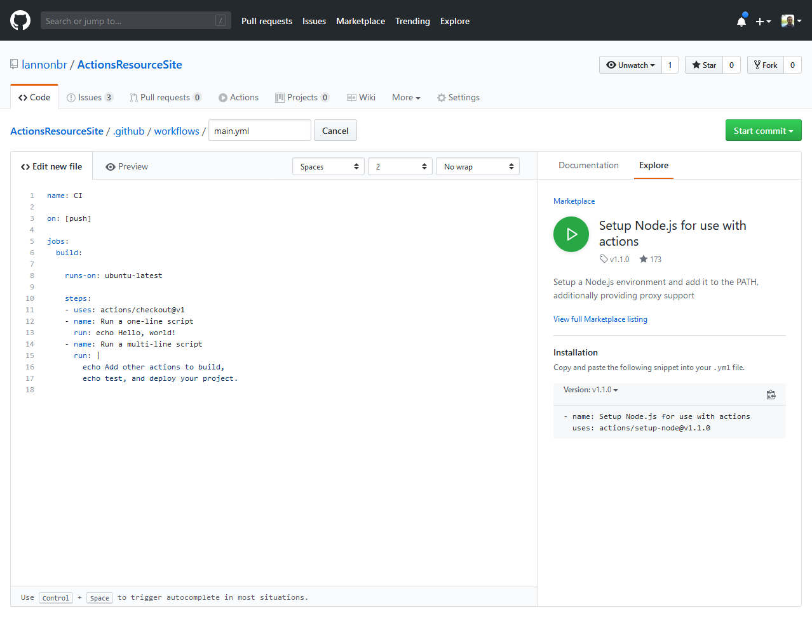

GitHub Actions which you want to share can be published onto the [GitHub Marketplace](https://github.com/marketplace). Rather than manually writing every single action you wish to create, finding published actions allows less code needed to be written overall and swaps from verbose workflows to more composable based on community written actions.

## Actions listing in the Marketplace

In the marketplace, if you click on the `Actions` type, a listing of GitHub Actions will appear on the screen. you can filter them by various categories on the left or search for something with a searchbar up top.

If you open up say the `setup-node` action that the Actions team built, you can see the readme from the action, how to use it, and other various details.

## Actions listing in the workflow editor

Alongside the actual marketplace section, if you are editing a GitHub Actions workflow using their editor, there is an `Explore` tab on the right side which will also present a view of all of the Actions in the marketplace.

If you click on one, you get a short description about the particular action and how to use such.

