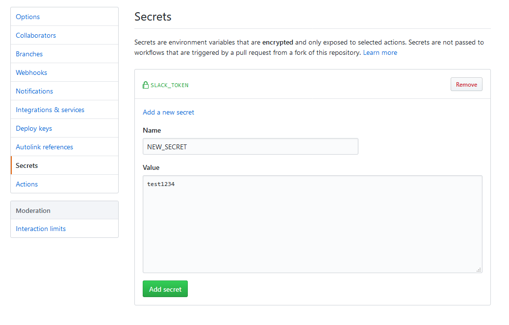

If you are running tasks that need some type of private credentials or auth tokens, storing them securely is a high priority. GitHub provides a way to provide secrets to your workflows. In the settings tab of a repository, there is a secrets page where you can insert secrets to be used by workflows.



You can add a new secret using the `Add a new secret` link which will open a form to submit a secret which will be a key-value pair mapping to the key for the secret and a string containing the actual secret.

Then when you wish to use it, there is a [workflow context](/docs/workflow-contexts/) called `secrets` that we can insert through either the `env` or `with` fields of an action or step:

```yaml title=workflow.yml
steps:
  - name: send message to slack
    uses: user/slack-action@v1
    with:
      slack_token: ${{ secrets.SLACK_TOKEN }}
```

To help from exposing the secrets publicily, these will never be printed out in logs and instead will be masked with asterisks. As well, if you submit a PR from a fork including a new workflow or modifying an existing one, it will execute in the fork and therefore will not use the base repo's secrets.
