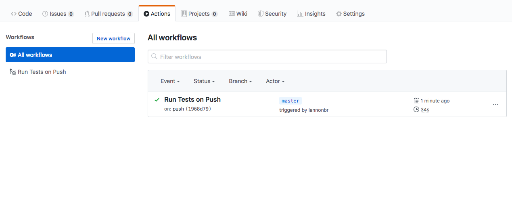
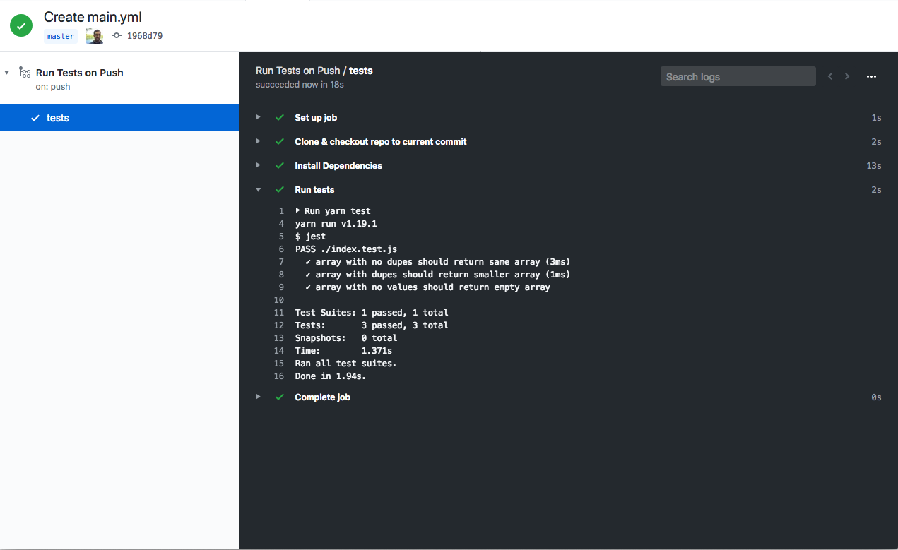
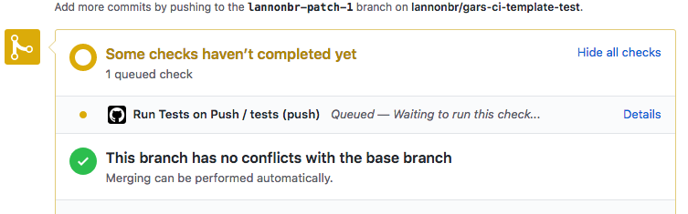
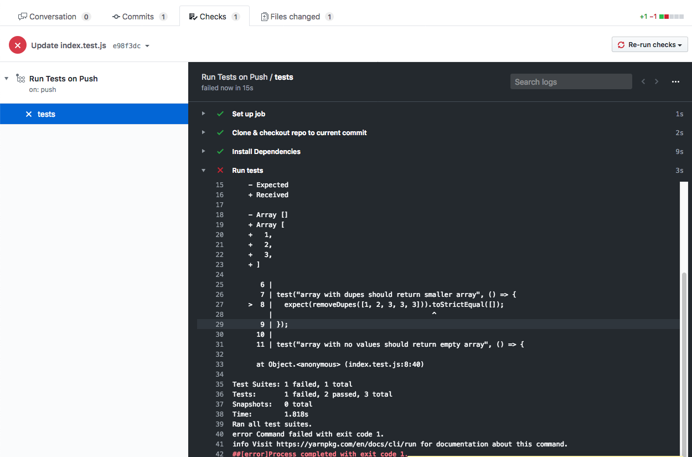
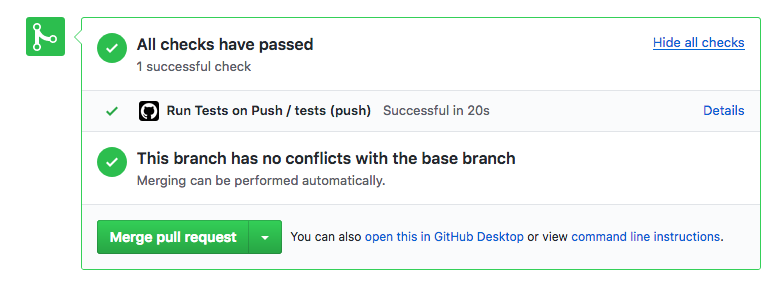
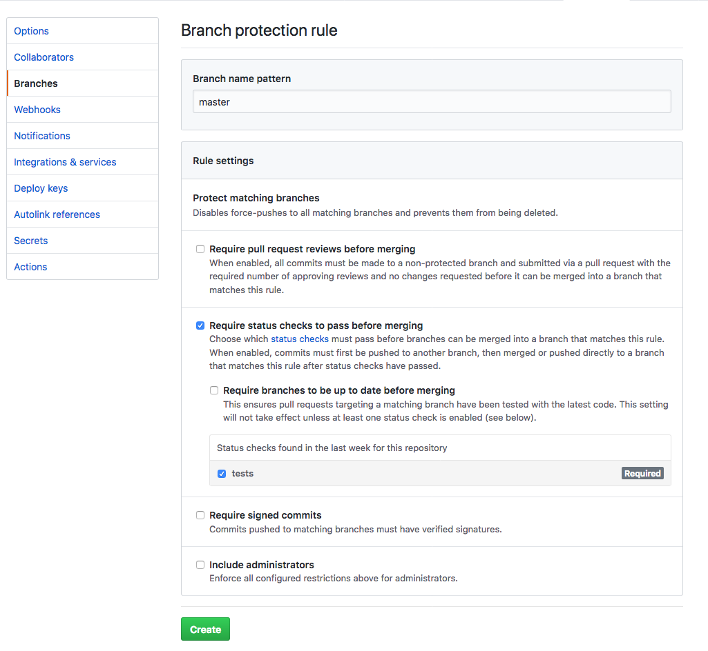
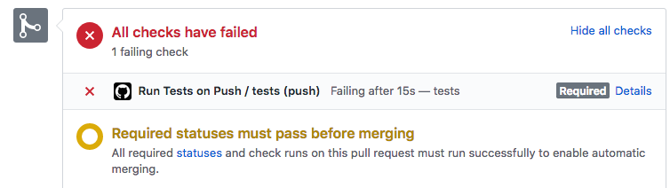

As an introductory tutorial into GitHub Actions, you'll be setting up a CI pipeline around a NodeJS app. You'll get an understanding for the architecture of a GitHub Actions workflow, the difference between a workflow, job, and step, and see how Actions connects into GitHub's Checks API.

## Setup

There's a template repo set up at https://github.com/lannonbr/gars-ci-template. Please click the "Use this Template" button to make a copy of it for yourself. It already has some tests setup with Jest so if you download it, install dependencies, and run `yarn test` or `npm test`, you'll see everything passes. It's a node package that has a function which will deduplicate entries in a array. Now you want to be able to setup a workflow on GitHub so any time a push is made, tests will be run to make sure our project doesn't breaks unexpectedly.

## Starting work on a workflow

To start, we want to break down the following statement from the previous section:

> Any time a push is made, tests will be run.

there's two portions to such, when we run it, and what it will do when run. In GitHub Actions, the "when" is called a Trigger, and it is the entrypoint for when a workflow is run. A workflow is a suite of code that acts upon these triggers.

So in this instance, you will create a workflow that runs on a `push` and that workflow will somehow run our tests. The location in your codebase where you put a workflow is in the `.github/workflows/` directory. So now create a YAML file there:

```yml title=ci.yml
# Here's our GitHub Actions workflow
```

the workflow file name is irrelevant but it is good to be descriptive with them to allow people to get an understanding of what the workflow may do even before you open it. For now given this is the only workflow, it is alright to call it something like `ci.yml`.

Now, The file is empty, so to start out, the trigger is the first part that can be implemented. You can set the trigger using the `on` key with a string that maps to the trigger that we want, which is `push`

```yml title=ci.yml
on: push
name: Run Tests on Push
```

I also added a `name` key so in GitHub's UI you will be able to see a descriptive name of what this workfow is.

## Setting up Jobs

The next portion of the workflow is to set up some jobs to run through. A job is a set of tasks needed to be done in a workflow that can be run either in parallel or in series. By default, all jobs will run at the same time unless you explicitly say that one job needs to wait until another job finishes.

Since there is one task we want to accomplish of running the tests, let's set up a single job. You can do such with the `jobs` key and create a named entry under it.

```yml title=ci.yml
on: push
name: Run Tests on Push
jobs:
  tests:
    # This is our tests job.
```

With such, each individual job runs in a completely isolated VM. You have to choose an Operating System for the VM which can be any of the following:

- Ubuntu Linux
- Windows Server
- MacOS

To pick one, you will use the `runs-on` key. Let's use the latest version of Ubuntu (which at the time of writing this is Ubuntu 18.04 LTS).

```yml title=ci.yml
on: push
name: Run Tests on Push
jobs:
  tests:
    runs-on: ubuntu-latest
```

Now that there is a setup VM, you need to get the environment ready and then actually run the tests. This can all be done with steps.

## One step at a time

Finally you are down to the atom layer of GitHub Actions workflows, the Step. Steps have 2 main portions, the name of a step, and what we want it to do. To start, the `steps` key will be an array of entries. Start out by cloning and checking out the project

```yml title=ci.yml
on: push
name: Run Tests on Push
jobs:
  tests:
    runs-on: ubuntu-latest
    steps:
      - name: Clone & checkout repo to current commit
```

alongside this, you can choose one of two methods of execution, `uses` or `run`. For our first step, GitHub kindly provided a bundled set of code to do clone and checkout the commit inside what is known as an Action. This action in particular is the `checkout` action, which can be found at https://github.com/actions/checkout/. To use an action, you will use the `uses` key and tell it what action to run. You point it to the action by using a `user/repo` syntax:

```yml title=ci.yml
on: push
name: Run Tests on Push
jobs:
  tests:
    runs-on: ubuntu-latest
    steps:
      - name: Clone & checkout repo to current commit
        uses: actions/checkout@v1
```

Afterwards, you can also define a specific reference to what version of the action you want to run. The master branch can be chosen by typing `actions/checkout@master` as the value for `uses`, but instead, you can use a versioned release at the `v1` tag which as seen in the code snippet above, is `actions/checkout@v1`.

This will clone the repo and checkout to the commit that was just pushed. The working directory that is set in this job is now filled with the latest state of the project.

Next you will want to install the node dependencies. Instead of going to find another action to do this, you can run code in a shell directly. This can be done with the `run` key which will run in the default shell of your OS. Since this is Ubuntu by default, it will be running in Bash.

You can run a command by replacing `uses` in the step with the `run` key and then type in what we want to run afterwards.

```yml title=ci.yml
on: push
name: Run Tests on Push
jobs:
  tests:
    runs-on: ubuntu-latest
    steps:
      - name: Clone & checkout repo to current commit
        uses: actions/checkout@v1
      - name: Install Dependencies
        run: yarn install
```

As notice, `yarn` and `node` is already installed the runner so there is no need to install them. This will now install any dependencies needed to run the tests. Finally you can copy that last step and run the tests in the same fashion.

```yml title=ci.yml
on: push
name: Run Tests on Push
jobs:
  tests:
    runs-on: ubuntu-latest
    steps:
      - name: Clone & checkout repo to current commit
        uses: actions/checkout@v1
      - name: Install Dependencies
        run: yarn install
      - name: Run tests
        run: yarn test
```

You just completed a fully featured workflow. Commit this and push it up to GitHub and see what happens.

## Testing our Workflow

If you hop over to your copy of the repo and click on the "Actions" panel, you should see a run of your workflow. Given a push to GitHub just happened, the workflow is immediately triggered as `push` is the trigger for this workflow.



If you click on the entry, you'll see a dashboard that has all of the jobs and steps that we wrote in action. If you wait a bit, all of the entries should complete and have a green checkmark which means every step along the way works and the project's tests are all passing.



Now for a test of this CI. Go over to the test file in GitHub's UI and go break one of the tests. For instance, You could change the expected value of the second test which without touching anything else should break the tests. when you choose to commit it, create a new branch for it and open a PR. Now in the PR, near where you can merge it, you will see a check pop up for the workflow you built and if you follow through it you can see now that the tests will fail.





So we can know the tests are failing. If we go revert such, the PR will come back and succeed again.



Finally, if you go into the settings panel and click "Branches", you can create a new rule that states to only allow merging if status checks pass, and we can require the specific `tests` job from our workflow.



Now if we create another PR that fails, it will say it can't be automatically merged until the checks pass.



## Conclusion

This wraps up this tutorial. You've created a CI system for running tests on a node project and can be extrapolated to other languages and toolchains. If you are interested in learning how to build an action, learn more in the [next tutorial](/tutorial/build-first-action/).
